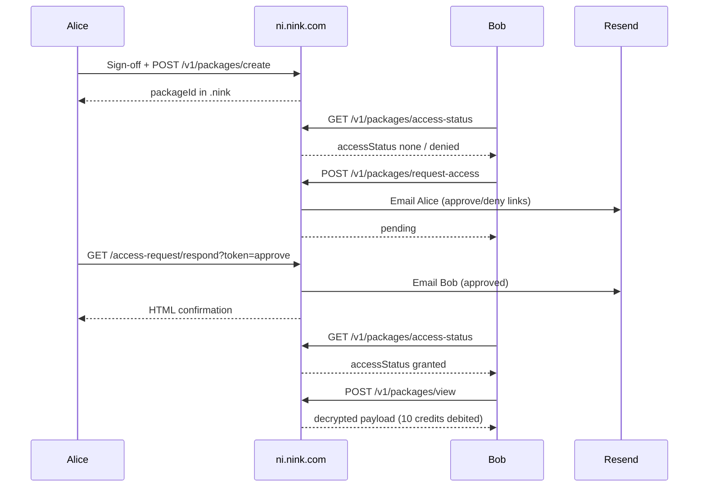

# Access control MVP

## Security model (summary)

1. **Alice** creates and owns a cloud-backed evidence package (`owner_id` = her `app_users` row).
2. **Bob** cannot view the package by default — even if he has Alice’s `.nink` and `.ninkkey`.
3. **Bob** may request access via the extension viewer (**Ask owner**).
4. **Alice** receives an email with **Approve** / **Deny** links (no login required for those links).
5. If **approved**, a row is created in `package_access_grants`; Bob may call cloud unlock APIs **if he has sufficient credits**.
6. If **denied** (or no response), Bob remains blocked from cloud unlock.

Local-only files (no `packageId`) are outside this model — they use free local `.ninkkey` decrypt.

## Roles

| Role | How determined | Cloud unlock |
|------|----------------|----------------|
| **Owner** | `evidence_packages.owner_id === user.id` | Yes (pays credits) |
| **Granted** | Row in `package_access_grants` | Yes (pays credits) |
| **Everyone else** | No grant | No — must request access |

Possession of files alone does not grant API access under strict cloud mode.

## Workflow



## Database tables

### `package_access_requests` (migration 006)

- One **pending** request per `(package_id, requester_id)`
- Status: `pending` | `approved` | `denied`
- Approve/deny tokens stored as **hashes**; raw tokens only in email links

### `package_access_grants` (migration 006)

- Unique `(package_id, granted_to_user_id)`
- Created on approval; links back to `request_id`

### `package_access_events` (migration 007)

Append-only audit log for access workflow (not the same as session `auditRecord` inside the package).

| `event_type` | When |
|--------------|------|
| `access_blocked` | Authenticated user checks status without grant (`none` or `denied`) |
| `unlock_denied` | User calls view/verify/report without owner or grant |
| `access_requested` | Successful `POST /v1/packages/request-access` |

Query example:

```sql
select created_at, event_type, actor_user_id, metadata
from package_access_events
where package_id = '<uuid>'
order by created_at desc;
```

## Email flow

| Event | Recipient | Content |
|-------|-----------|---------|
| Access requested | Owner (Alice) | Requester email, package title, Approve / Deny buttons |
| Approved | Requester (Bob) | Approval notice; open viewer while signed in |
| Denied | Requester (Bob) | Denial notice |

Links base URL: `NINK_PUBLIC_BASE_URL` (default `https://ni.nink.com`).

## Extension viewer rules

- **Ask owner** appears in the cloud panel when `packageId` is set and user is not owner/granted/pending.
- User must be **signed in** to submit a request (button visible before sign-in; click prompts sign-in).
- After approval, Bob must **reload** the viewer tab so `access-status` refreshes.
- Strict cloud mode blocks local `.ninkkey` decrypt when `packageId` is present.

## API authorization errors

| HTTP | Meaning |
|------|---------|
| `401` | Not signed in |
| `402` | Insufficient credits (paid actions only) |
| `403` | `PackageAccessError` — not owner, not granted |
| `409` | Duplicate pending request or invalid request state |

## What this MVP does not do

- No org-level sharing or ACLs
- No share links / public URLs for packages
- No automatic notify-owner on failed unlock attempts (only logged in `package_access_events`)
- No in-app inbox for Alice — email only
- No expiry on grants (grant persists until revoked — **revocation not implemented**)
